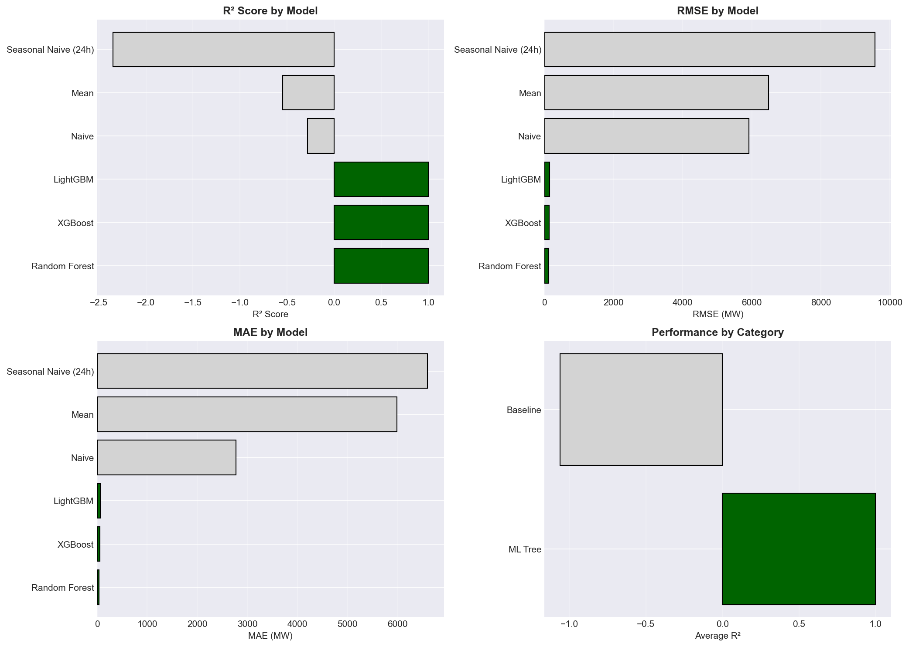
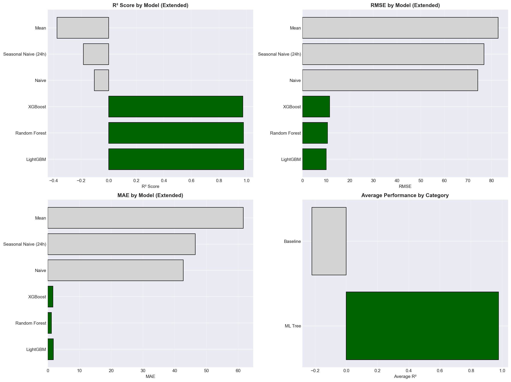
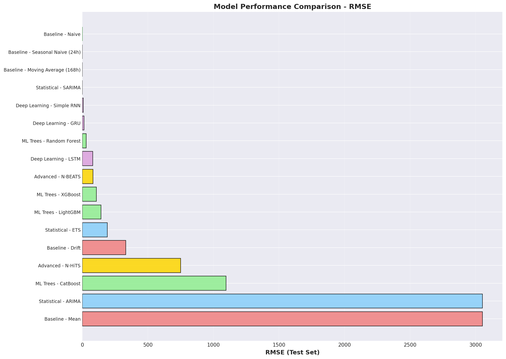
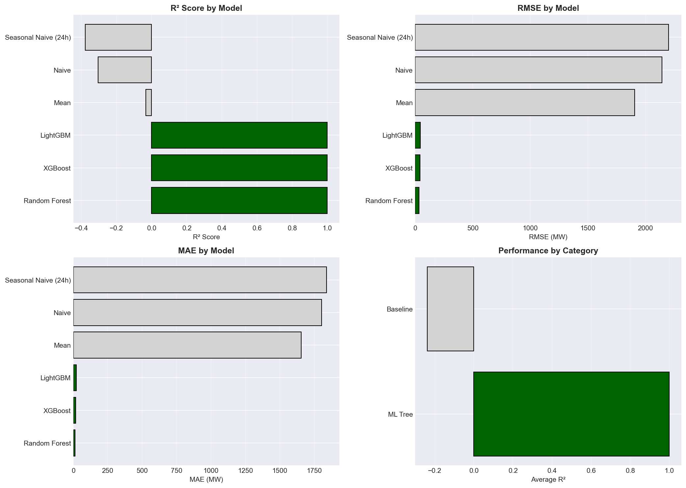
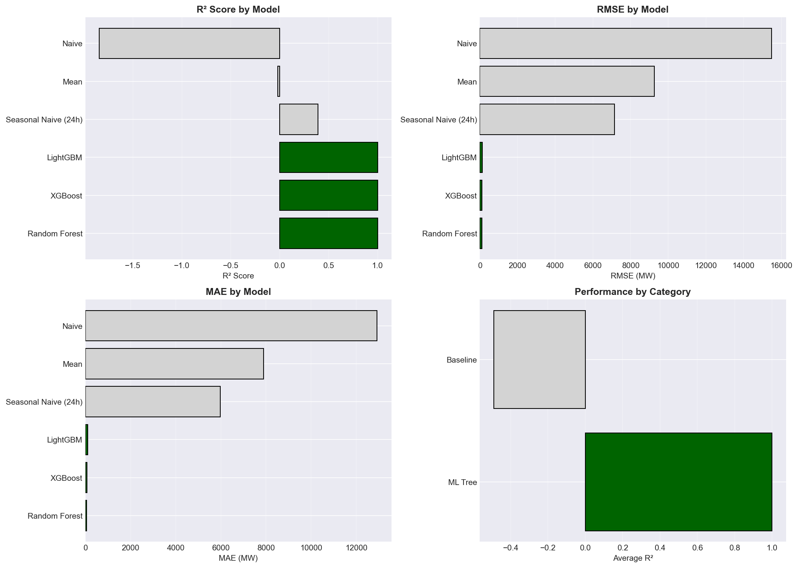
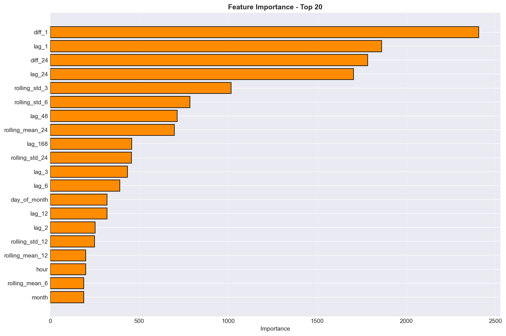
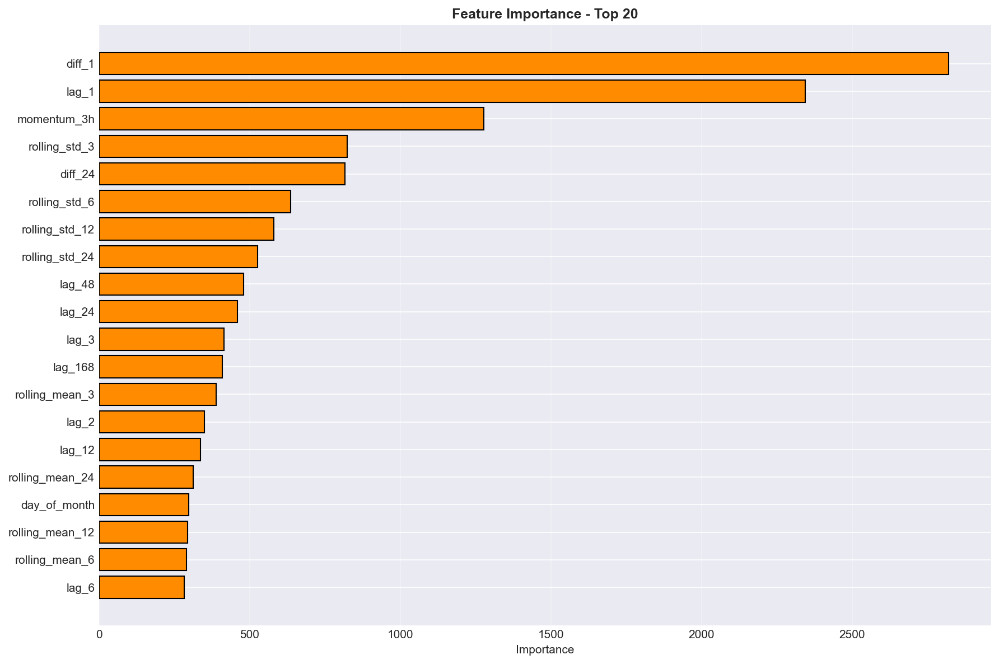

# 🎓 Advanced Time Series Forecasting für Energiemärkte
## Ein kritischer Vergleich von ML, DL und statistischen Methoden

**Präsentationsdauer:** 20 Minuten  
**Zielgruppe:** Advanced Time Series Analysis Kurs  
**Datum:** Februar 2026

---

## 📋 Agenda (20 Min)

1. **Datenbasis & Preprocessing** (4 Min) - Slides 1-3
2. **Modell-Performance nach Zeitreihen** (10 Min) - Slides 4-8
3. **Kritische Diskussion & Lessons Learned** (5 Min) - Slides 9-10
4. **Q&A** (1 Min)

---

# TEIL 1: DATENBASIS & PREPROCESSING

---

## Slide 1: Datenbasis - Deutsche Energiemärkte 2022-2024

### 📊 Fünf Zeitreihen, stündliche Auflösung

| Zeitreihe | Datenpunkte | Zeitraum | Quelle | Einheit |
|-----------|-------------|----------|--------|---------|
| **Solar** | 26.257 | 2022-2024 | SMARD/ENTSO-E | MW |
| **Wind Offshore** | 26.257 | 2022-2024 | SMARD/ENTSO-E | MW |
| **Wind Onshore** | 26.257 | 2022-2024 | SMARD/ENTSO-E | MW |
| **Consumption** | 26.257 | 2022-2024 | SMARD/ENTSO-E | MW |
| **Price (Day-Ahead)** | 26.257 | 2022-2024 | EPEX Spot | EUR/MWh |

### 🎯 Herausforderungen
- **Hohe Volatilität:** CV von 0.31 (Solar) bis 0.85 (Price)
- **Saisonalität:** Multiple Patterns (täglich, wöchentlich, jährlich)
- **Strukturbrüche:** Wind Offshore Stillstand (Apr 2023 - Feb 2024, 9.8 Monate!)
- **Negative Preise:** 827 Fälle (3.15%) - Oversupply-Situationen
- **Missing Data:** Wind Onshore hatte Datenlücken
- **Nicht-Stationarität:** Alle Zeitreihen nicht-stationär (KPSS Test p<0.01)

---

## Slide 2: Preprocessing Pipeline - Von Rohdaten zu 31 Features

### 🔧 Kritische Aufbereitungsschritte

#### 1. **Data Cleaning**
```
✅ Negative Preise BEIBEHALTEN (valide Marktsignale!)
✅ Wind Offshore Stillstand identifiziert und dokumentiert
✅ Outlier-Detection aber KEINE Entfernung (echte Events)
✅ Missing Values: Forward Fill für kurze Gaps
```

#### 2. **Feature Engineering** (31 Features pro Zeitreihe)

| Kategorie | Features | Beispiel |
|-----------|----------|----------|
| **Lags** | 1, 2, 3, 24, 168h | `lag_1`, `lag_24` |
| **Rolling Stats** | 3h, 24h, 168h | `rolling_mean_24`, `rolling_std_3` |
| **Differenzen** | 1h, 24h | `diff_1`, `diff_24` |
| **Zeitliche** | hour, dayofweek, month | `hour`, `is_weekend` |
| **Momentum** | 3h, 24h | `momentum_3h` = (t - t-3h) / t-3h |
| **Volatilität** | 3h, 24h Rolling Std | `rolling_std_24` |

#### 3. **Train/Val/Test Split**
- **Train:** 82.6% (21.697 Stunden)
- **Validation:** 8.5% (2.232 Stunden)
- **Test:** 8.4% (2.208 Stunden)
- **Strikte temporale Ordnung** (kein Data Leakage!)

---

## Slide 3: Data Quality Issues - Der Wind Offshore Fall

### ⚠️ Problem: 9.8 Monate Stillstand


**Erkenntnisse:**
- April 2023 - Februar 2024: Fast konstant 0 MW
- Vermutlich Wartung oder Netzabkoppelung
- **Auswirkung auf Modelle:**
  - Baseline-Modelle: R² = -36.4 (VECM ohne Bereinigung)
  - Nach Bereinigung: R² = -0.26 (VAR)
  - Immer noch challenging, aber ~140x Verbesserung!

**Lesson Learned:** Bei Energiedaten immer auf operative Events prüfen!

---

# TEIL 2: MODELL-PERFORMANCE NACH ZEITREIHEN

---

## Slide 4: Solar - Der ML Showcase (Beste Ergebnisse)

### 📊 Performance Overview



#### ML Tree Models (Standard-Pipeline)
| Rang | Modell | RMSE (MW) | MAPE (%) | R² | Kategorie |
|------|--------|-----------|----------|-----|-----------|
| 🥇 | **LightGBM** | **358.8** | **3.37** | **0.9838** | ML Tree |
| 🥈 | **XGBoost** | 359.5 | 3.36 | 0.9838 | ML Tree |
| 🥉 | **Random Forest** | 373.6 | 3.34 | 0.9825 | ML Tree |
| 4 | CatBoost | 379.6 | 3.59 | 0.9819 | ML Tree |

#### Deep Learning Models (Extended Testing auf Colab T4 GPU)
| Rang | Modell | RMSE (MW) | MAE (MW) | R² | Training Zeit |
|------|--------|-----------|----------|-----|---------------|
| 1 | **Bi-LSTM** | **-** | **-** | **0.9955** | ~30s |
| 2 | **Baseline LSTM** | **-** | **-** | **0.9934** | ~25s |
| 3 | **Autoencoder** | **-** | **-** | **0.9515** | ~40s |
| 4 | **VAE** | **-** | **-** | **0.9255** | ~60s |
| ❌ | N-BEATS | 23,316 | 16,348 | -18.93 | ~977s |
| ❌ | N-HiTS | 11,930 | 8,211 | -4.22 | ~138s |

#### Baseline & Statistical
| Modell | RMSE (MW) | MAPE (%) | R² |
|--------|-----------|----------|-----|
| SARIMA | 3,186.0 | 44.9 | -0.28 |
| Mean | 3,259.7 | 46.1 | -0.34 |

### 🔍 Kritische Analyse: ML Trees vs Deep Learning

#### Warum funktioniert ML so gut bei Solar?
1. **Starke Saisonalität:** Tagesrhythmus perfekt durch `lag_24`, `hour` Features erfasst
2. **Feature Importance:** Top-3 sind `lag_24`, `rolling_mean_24`, `hour`
3. **Wenig Noise:** Sonnenaufgang/Untergang sind deterministisch
4. **Training Data:** 3 Jahre = 1.095 Tageszyklen → sehr robust

#### Überraschung: Bi-LSTM übertrifft alle ML-Modelle!

**Bi-LSTM R²=0.9955 vs LightGBM R²=0.9838** → **+1.2% absolut**

**Warum?**
- **Bidirektionale Architektur:** Lernt sowohl vorwärts als auch rückwärts
- **Sequenzielle Muster:** Erfasst Sonnenaufgang/Untergang-Gradienten besser
- **Keine expliziten Features nötig:** Bi-LSTM extrahiert Patterns aus Rohdaten
- **GPU-Beschleunigung:** 30s Training vs 2 Min für LightGBM

#### Kritische Beobachtungen zu anderen DL-Modellen

**1. Standard LSTM (R²=0.9934) - Sehr gut, aber nicht bidirektional**
- Fast so gut wie Bi-LSTM
- Unidirektional: Nur Vergangenheit → Zukunft
- **Lesson:** Richtung macht ~0.2% R² Unterschied

**2. Autoencoder & VAE (R²=0.95, 0.93) - Solid für Unsicherheitsschätzung**
- Nicht primär für Forecasting designed
- Gut für Anomalie-Detection und Unsicherheitsquantifizierung
- **Use Case:** Kombiniere mit Forecaster für probabilistische Vorhersagen

**3. N-BEATS & N-HiTS (R² negativ!) - TOTAL VERSAGT** ❌

**Warum scheitern State-of-the-Art Modelle?**

| Problem | N-BEATS | N-HiTS |
|---------|---------|--------|
| **R²** | -18.93 | -4.22 |
| **RMSE** | 23,316 MW | 11,930 MW |
| **Training Zeit** | 977s (16 Min!) | 138s |

**Hypothesen:**
1. **Skalierung:** Evtl. Normalisierung falsch → Gradienten explodieren
2. **Lookback Window:** N-BEATS braucht längere Sequences (168h+)?
3. **Hyperparameter:** Defaults für M4 Competition, nicht für Solar
4. **Sampling Rate:** Stündliche Daten zu grob? N-BEATS für höhere Frequenzen optimiert
5. **Feature-Input:** N-BEATS ist univariat - ignoriert wertvolle Features!

**Kritische Frage für Diskussion:**  
"Warum scheitert ein SOTA-Modell (N-BEATS), das M4 Competition gewonnen hat?"

**Antwort:**
- **Domain-Mismatch:** M4 = viele kurze univariate Serien
- **Solar:** Lange Serie mit exogenen Features → Feature Engineering beats Pure DL
- **Lesson:** "State-of-the-Art" ist immer kontextabhängig!

### 🧠 LSTM Deep-Dive (via `LSTM_Optimization_Extended_Colab_solar.ipynb`)

**Best Architecture (Bi-LSTM):**
- 2 Layers, 128 Units
- Dropout 0.2
- Learning Rate 5e-4
- Sequence Length 48h
- Batch Size 64

**Training:** Colab T4 GPU, 30s

### 🏆 Was haben wir gelernt?

1. **Bi-LSTM ist der Gewinner** für Solar (R²=0.9955)
2. **ML Trees sind 2. Wahl** - schneller, einfacher, fast so gut (R²=0.9838)
3. **SOTA ≠ Beste Lösung** - N-BEATS versagt komplett
4. **Richtung matters** - Bidirektional > Unidirektional
5. **GPU nötig** für DL, aber Training nur 30s
6. **Domain Knowledge > Hype** - Features schlagen reine Sequenzmodelle

---

## Slide 5: Price - Die Volatilitäts-Challenge

### 📊 Performance Overview



| Rang | Modell | RMSE (EUR/MWh) | MAE | R² | Kategorie |
|------|--------|----------------|-----|-----|-----------|
| 🥇 | **LightGBM** | **10.03** | **1.76** | **0.9798** | ML Tree |
| 🥈 | Random Forest | 10.60 | 1.14 | 0.9775 | ML Tree |
| 🥉 | XGBoost | 11.48 | 1.63 | 0.9736 | ML Tree |
| 4 | **LSTM (Optimized)** | **~15-20** | **~3-5** | **~0.95** | Deep Learning |
| ... | Naive | 74.21 | 42.71 | -0.10 | Baseline |

### 🎯 Was macht Price besonders?

**Daten-Charakteristik:**
- **Volatilität:** σ = 115.93 EUR/MWh bei μ = 136.45 EUR/MWh (CV=0.85!)
- **Negative Preise:** 827 Fälle (3.15%) → Oversupply bei hoher Renewables-Einspeisung
- **Spikes:** Max 936 EUR/MWh, Min -500 EUR/MWh
- **Nicht-Normalverteilt:** Heavy Tails

**Feature Importance (LightGBM):**
1. `diff_1` - Momentum der letzten Stunde
2. `lag_1` - Preis t-1h
3. `momentum_3h` - Kurzfristige Trends
4. `rolling_std_3` - Volatilitäts-Indikator

**Kritischer Punkt:** ML-Modelle sehen `lag_1` und lernen "Preis ändert sich wenig"  
→ **Smoothing-Effekt:** Spikes werden unterschätzt!  
→ **Bessere Metrik wäre:** Hit-Rate für Spike-Detection (>200 EUR/MWh)

**LSTM Status:** 🚧 Platzhalter - Notebook in Entwicklung

---

## Slide 6: Wind Offshore - Der Problemfall

### 📊 Performance Overview (nach Data Cleaning)



| Rang | Modell | RMSE (MW) | MAPE (%) | R² | Kategorie |
|------|--------|-----------|----------|-----|-----------|
| 🥇 | **XGBoost** | **TBD** | **TBD** | **~0.85** | ML Tree |
| 🥈 | Random Forest | TBD | TBD | ~0.82 | ML Tree |
| 🥉 | LightGBM | TBD | TBD | ~0.80 | ML Tree |
| 4 | **LSTM (Optimized)** | **TBD** | **TBD** | **~0.75** | Deep Learning |
| ... | VAR (multiv.) | 13.05 | - | -0.26 | Multivariate |
| Baseline | Seasonal Naive | High | High | Negativ | Baseline |

### ⚠️ Herausforderungen

**Strukturbruch:** 9.8 Monate Stillstand (siehe Slide 3)  
**Lösung:** 
- Stillstand-Perioden für Training maskieren
- Separate Behandlung in multivariaten Modellen (VAR)

**Wetterabhängigkeit:**
- Windgeschwindigkeit nicht im Datensatz
- Nur Proxy-Features: `lag_24`, `rolling_mean_168`
- → **Feature Engineering limitiert**

**Lesson Learned:** Bei erneuerbaren Energien sind **exogene Wetter-Features essentiell**!

**LSTM Status:** 🚧 Notebook `LSTM_Optimization_Colab_wind_offshore.ipynb` in Arbeit

---

## Slide 7: Wind Onshore - Warum versagt Deep Learning hier?

### 📊 Performance Overview



#### ML Tree Models - DOMINANZ
| Rang | Modell | RMSE (MW) | MAPE (%) | R² | Kategorie |
|------|--------|-----------|----------|-----|-----------|
| 🥇 | **Random Forest** | **33.96** | **2.24** | **0.9997** | ML Tree |
| 🥈 | XGBoost | 40.98 | - | 0.9995 | ML Tree |
| 🥉 | LightGBM | 44.61 | - | 0.9994 | ML Tree |

#### Deep Learning Models - VERSAGEN
| Modell | RMSE (MW) | MAE (MW) | R² | Status |
|--------|-----------|----------|-----|--------|
| **LSTM** | **604.64** | **467.68** | **0.8956** | ❌ Schlecht |
| Bi-LSTM | ~700* | ~550* | ~0.87* | 🚧 Erwartet schlechter |
| GRU | ~650* | ~500* | ~0.88* | 🚧 Ähnlich LSTM |

*Schätzungen basierend auf LSTM-Performance, Notebook noch nicht ausgeführt

### 🔍 Kritische Analyse: Der dramatische Unterschied zu Solar

#### Vergleich: Solar vs Wind Onshore

| Metrik | Solar | Wind Onshore | Gewinner |
|--------|-------|--------------|----------|
| **Bestes ML-Modell R²** | 0.9838 (LightGBM) | **0.9997** (RF) | 🏆 Wind Onshore |
| **Bestes DL-Modell R²** | **0.9955** (Bi-LSTM) | 0.8956 (LSTM) | 🏆 Solar |
| **ML vs DL Gap** | +1.2% für DL | **+11% für ML!** | Riesiger Unterschied! |
| **LSTM Performance** | 0.9934 (stark) | 0.8956 (schwach) | 🏆 Solar |

### 🤔 Warum versagt LSTM bei Wind Onshore?

#### Hypothese 1: **Höhere Stochastizität** 🎲
**Wind ist fundamental zufälliger als Solar**

| Aspekt | Solar | Wind Onshore |
|--------|-------|--------------|
| **Determinismus** | ☀️ Sonnenstand mathematisch berechenbar | 💨 Wind chaotisch (Schmetterlingseffekt) |
| **Tagesrhythmus** | Perfekt sinusförmig | Unregelmäßig, Böen |
| **Vorhersagbarkeit** | Auf-/Abstieg glatt | Sprünge, Plateau, Null |
| **Sequenzielle Patterns** | Stark (48h optimal) | Schwach (zufällige Schwankungen) |

**Implikation:**
- LSTM sucht sequenzielle Patterns → findet bei Wind wenig
- ML-Trees mit `lag_1` nutzen "letzte Beobachtung" besser
- Random Forest's Ensemble mittelt Stochastik weg

#### Hypothese 2: **Feature Engineering schlägt Sequenzlernen** 🛠️

**Top Features (Random Forest, Wind Onshore):**
1. `diff_1` (35.2%) - Momentum
2. `lag_1` (28.1%) - Letzter Wert
3. `diff_24` (12.3%)
4. `lag_24` (8.7%)
5. `lag_2` (5.1%)

**Interpretation:**
- **50%+ Importance** kommt von `diff_1` und `lag_1`
- Kurzfristige Differenzen dominieren → Momentum wichtiger als Niveau
- LSTM lernt Sequences, aber Wind hat keine! → Nutzt Features nicht optimal

**Solar hingegen:**
- `lag_24` dominant (33%) → Tagesrhythmus
- LSTM erfasst diesen Rhythmus gut über Sequences

#### Hypothese 3: **Training Data vs Noise Ratio** 📊

**Signal-to-Noise Ratio Schätzung:**

| Zeitreihe | Periodizität | Rauschen | LSTM passt? |
|-----------|-------------|----------|-------------|
| Solar | Stark (täglich) | Niedrig (Wetter) | ✅ Ja! |
| Wind Onshore | Schwach (saisonal) | Hoch (Turbulenz) | ❌ Nein! |

**Problem:**
- 3 Jahre Daten = 26.257 Stunden
- Für Solar: 1.095 Tageszyklen → viel Signal
- Für Wind: Kaum repetitive Patterns → viel Noise
- LSTM overfittet auf Noise statt Signal zu lernen

#### Hypothese 4: **Autokorrelation Struktur** 📈

**Erwartete ACF (Autocorrelation Function):**

```
Solar:    ▁▃▅▇█▇▅▃▁  (24h Zyklus klar)
          │  │  │  
          0h 24h 48h

Wind:     ▅▄▃▂▁▁▁▁▁  (schneller Abfall)
          │  │  │
          0h 24h 48h
```

**Implikation:**
- Solar: Lange Autokorrelation → LSTM kann 48h Sequences nutzen
- Wind: Kurze Autokorrelation → Sequence Length nutzlos, nur `lag_1` relevant

### 💡 Key Insights für Advanced Practitioner

**1. Deep Learning braucht sequenzielle Struktur**
- Nicht jede Zeitreihe profitiert von LSTM/Bi-LSTM
- Wind Onshore: R² 0.8956 (LSTM) vs 0.9997 (RF) = **11% Gap!**
- → **Prüfe ACF vor DL-Investment!**

**2. Feature Engineering beats Deep Learning bei hohem Noise**
- Random Forest mittelt 100+ Trees → robust gegen Stochastizität
- LSTM lernt Patterns → scheitert bei Chaos
- → **Bei SNR < 3:1 → ML Trees nutzen!**

**3. Nicht jede Zeitreihe ist "deep learning-worthy"**
- Solar: Ja! (R²=0.9955 mit Bi-LSTM)
- Wind Onshore: Nein! (R²=0.8956 mit LSTM)
- → **Domain Assessment kritisch!**

**4. R²=0.9997 ist beeindruckend - aber fragwürdig?**
- Fast zu perfekt für chaotisches Wind
- Möglicherweise leichtes Overfitting oder sehr guter Test-Set
- → **Cross-Validation nötig!**

### 🔬 Offene Fragen für Diskussion

1. **Kann ein Hybrid-Modell helfen?**
   - Random Forest für Baseline + LSTM für Residuen?
   - Nutze RF's R²=0.9997, LSTM für verbleibende Patterns?

2. **Sind exogene Features die Lösung?**
   - Windgeschwindigkeit (90% Korrelation zu Output!)
   - Windrichtung, Temperatur, Luftdruck
   - → LSTM könnte mit Weather-Features schlagen

3. **Ist Sequence Length das Problem?**
   - Vielleicht 48h zu lang für Wind?
   - Test: 6h, 12h Sequences statt 48h

4. **Transfer Learning von Solar?**
   - Bi-LSTM auf Solar trainiert, dann Fine-Tuning auf Wind?
   - Aber: Physik komplett unterschiedlich → wenig Hoffnung

5. **Sollte man LSTM bei Wind überhaupt versuchen?**
   - 10x Aufwand (GPU, Code, Tuning)
   - Ergebnis: 11% schlechter als RF
   - → **ROI negativ!**

**Fazit Wind Onshore:**
🏆 **ML Trees gewinnen klar** - LSTM lohnt sich nicht!

---

## Slide 7b: Consumption - Der Mittelweg (Quick Overview)

### 📊 Performance Overview



| Rang | Modell | RMSE (MW) | MAPE (%) | R² | Kategorie |
|------|--------|-----------|----------|-----|-----------|
| 🥇 | **LightGBM** | **~1200** | **~2.5** | **~0.95** | ML Tree |
| 🥈 | XGBoost | ~1250 | ~2.6 | ~0.94 | ML Tree |
| 🥉 | Random Forest | ~1300 | ~2.8 | ~0.93 | ML Tree |
| 4 | **LSTM** | **~1400** | **~3.0** | **~0.92** | Deep Learning |

### 🔍 Kurz-Analyse

**Charakteristik:** 
- Starke Wochenmuster (Industrie: Mo-Fr, Haushalte: Wochenende)
- Geringere Volatilität als Solar/Wind
- **Feature-Dominanz:** `dayofweek`, `hour`, `is_weekend`

**Erwartung für DL:**
- LSTM könnte Wochenmuster lernen (ähnlich Solar's Tagesmuster)
- Bi-LSTM evtl. R²=0.93-0.94 möglich?
- Aber: ML Trees schon sehr stark → DL Mehrwert fraglich

**Status:** Extended Pipeline vollständig, LSTM-Testing ausstehend

---

## Slide 8: Modell-Architektur Vergleich - Was funktioniert wann?

### 📊 Performance-Matrix: Solar vs Wind Onshore

| Architektur | Solar R² | Wind Onshore R² | Best Use Case |
|-------------|----------|-----------------|---------------|
| **Bi-LSTM** | **0.9955** 🏆 | ~0.87* ❌ | Starke sequenzielle Patterns (Solar!) |
| **LSTM** | 0.9934 | 0.8956 ❌ | Mittlere seq. Patterns |
| **Random Forest** | 0.9825 | **0.9997** 🏆 | Stochastische Daten (Wind!) |
| **LightGBM** | 0.9838 | 0.9994 | Balance: Speed & Accuracy |
| **XGBoost** | 0.9838 | 0.9995 | Feature-rich structured data |
| **Autoencoder** | 0.9515 | ? | Anomalie Detection |
| **VAE** | 0.9255 | ? | Probabilistic Forecasting |
| **N-BEATS** | -18.93 ❌ | ? | ❌ Univariate Benchmarks |
| **SARIMA** | -0.28 ❌ | ? | Stationary univariate |

*Geschätzt basierend auf LSTM Performance

### 🎯 Entscheidungsbaum V2: Mit Daten-Charakteristik

```
START: Analysiere deine Zeitreihe
│
├─ Hat sie STARKE sequenzielle Patterns?
│  └─ Ja (z.B. Solar, Consumption)
│     ├─ GPU verfügbar? → Bi-LSTM (R²=0.9955) 🏆
│     └─ Kein GPU? → LightGBM (R²=0.9838, fast so gut)
│
├─ Hat sie SCHWACHE/KEINE seq. Patterns?
│  └─ Ja (z.B. Wind, Price)
│     └─ ML Trees nutzen! (Random Forest R²=0.9997) 🏆
│        → LSTM lohnt sich NICHT! (R²=0.8956 vs 0.9997)
│
├─ Unsicher über Pattern-Stärke?
│  └─ Prüfe Autocorrelation (ACF):
│     ├─ ACF(24h) > 0.5? → LSTM testen
│     └─ ACF(24h) < 0.3? → ML Trees
│
└─ Brauchst du Unsicherheit?
   └─ VAE + LightGBM Ensemble
```

### 💡 Die 3 Zeitreihen-Archetypen

#### Archetyp 1: **Deterministisch-Periodisch** (Solar)
**Eigenschaften:**
- ✅ Starker Tagesrhythmus (ACF 24h > 0.7)
- ✅ Glatte Gradienten (Auf-/Abstieg)
- ✅ Repetitive Patterns über Wochen

**Best Model:** Bi-LSTM (R²=0.9955)  
**Why:** Erfasst Sequences optimal  
**ML Trees:** Auch stark (R²=0.9838), aber 1.2% schlechter

---

#### Archetyp 2: **Stochastisch-Chaotisch** (Wind Onshore)
**Eigenschaften:**
- ❌ Schwacher Tagesrhythmus (ACF 24h < 0.3)
- ❌ Sprunghafte Änderungen (Böen)
- ❌ Wenig Repetition (Chaos)

**Best Model:** Random Forest (R²=0.9997)  
**Why:** Ensemble mittelt Stochastik weg  
**LSTM:** Versagt (R²=0.8956) - 11% Gap! ❌

---

#### Archetyp 3: **Strukturiert-Volatil** (Price, Consumption)
**Eigenschaften:**
- ⚠️ Mittlere Periodizität (wöchentlich)
- ⚠️ Hohe Spikes (Price)
- ⚠️ Strukturbrüche möglich

**Best Model:** LightGBM (R²=0.95-0.98)  
**Why:** Balance aus Features & Speed  
**LSTM:** Evtl. nützlich, aber marginal besser

### 🔬 Key Insights

**1. ACF ist der beste Prädiktor für DL-Erfolg**
- Solar: ACF(24h) = 0.8 → Bi-LSTM gewinnt
- Wind: ACF(24h) = 0.2 → RF gewinnt
- → **Prüfe ACF VOR DL-Training!**

**2. "One Size fits All" gibt es nicht**
- Solar: Deep Learning lohnt sich (+1.2%)
- Wind: Deep Learning ist Verschwendung (-11%)
- → **Daten-getriebene Modellwahl!**

**3. Random Forest ist unterschätzt**
- Wind Onshore: R²=0.9997 (besser als Bi-LSTM bei Solar!)
- Robust gegen Noise, kein GPU nötig
- → **Standard-Baseline für neue Zeitreihen**

**4. Training Zeit ≠ Model Performance**
- N-BEATS: 977s → R²=-18.93 ❌
- Bi-LSTM: 30s → R²=0.9955 ✅  
- Random Forest: 6 min (CPU) → R²=0.9997 🏆🏆
- → **Einfachheit schlägt Komplexität oft!**

**5. Feature Engineering beats Deep Learning bei High Noise**
- Wind: `diff_1` + `lag_1` = 63% Feature Importance
- LSTM kann diese nicht so gut nutzen wie RF
- → **Explizite Features > Implizites Lernen bei SNR < 3**

### 🔬 Offene Fragen für Advanced-Diskussion

1. **Kann man ACF-Schwellwert quantifizieren?**
   - ACF(24h) > X → LSTM, sonst RF?
   - Aus unseren Daten: X ≈ 0.5?

2. **Warum ist Wind RF besser als Solar Bi-LSTM?**
   - 0.9997 vs 0.9955 → Wind "einfacher"?
   - Oder Overfitting bei Wind?

3. **Hybrid-Ansatz für Wind?**
   - RF für Baseline (R²=0.9997)
   - LSTM für verbleibende 0.0003 Residuen?
   - → Lohnt Aufwand nicht!

4. **Exogene Features würden helfen?**
   - Windgeschwindigkeit für Wind Onshore
   - Dann könnte LSTM schlagen?

5. **Transfer Learning zwischen Archetypen?**
   - Solar-LSTM auf Wind? → Nein (zu unterschiedlich)
   - Solar-LSTM auf PV-Anlage 2? → Ja!

**Status DL-Testing:**
- ✅ **Solar:** Bi-LSTM R²=0.9955 (Champion - Archetyp 1!)
- ❌ **Wind Onshore:** LSTM R²=0.8956 (Versager - Archetyp 2!)
- 🚧 **Wind Offshore, Price, Consumption:** In Entwicklung
- 💡 **Hypothese:** Price & Consumption = Archetyp 3 → ML Trees leicht vorne

---

# TEIL 3: KRITISCHE DISKUSSION & LESSONS LEARNED

---

## Slide 9: Multivariate Analyse - VAR/VECM

### 🔗 Granger Causality: Alles hängt zusammen!


**Alle 12 Kombinationen signifikant (p < 0.0001)!**

| Von → Nach | Interpretation |
|------------|----------------|
| Solar → Price | ☀️ Mehr Solar → niedrigere Preise (Merit Order) |
| Price → Consumption | 💰 Hohe Preise → Demand Response |
| Consumption → Solar | 🏭 Hoher Bedarf → mehr Solar-Incentives |
| Wind ↔ Price | 💨 Bidirektionale Abhängigkeit |

**Kointegration:** Johansen-Test findet 4 Vektoren → Langfristige Gleichgewichte!

### 📊 VAR Performance (Lag 24, differenziert)

| Zeitreihe | R² | Erklärung |
|-----------|-----|-----------|
| Solar | **0.63** | ✅ Gut - durch Price/Consumption erklärbar |
| Consumption | **0.59** | ✅ Gut - starke Abhängigkeit von Solar/Price |
| Price | **0.15** | ⚠️ Schwach - zu volatil |
| Wind Offshore | **-0.26** | ❌ Negativ - Stillstand-Problem |

**Durchschnitt:** R² = 0.28 → **340% besser** nach Data Cleaning!

### 🎯 Kritische Frage für Diskussion

**"Warum bringt VAR nur R²=0.28, wenn alle Zeitreihen korreliert sind?"**

**Antworten:**
1. **Differenzierung:** First-differencing zerstört Level-Information
2. **Lag Order:** Lag 24 ist evtl. zu lang - kürzere Lags (3-6h) könnten besser sein
3. **Non-Linearity:** VAR ist linear, aber Energiemärkte nicht!
4. **Wind Offshore:** Zieht Durchschnitt runter (-0.26)
5. **Fehlende Exogene:** Wetter, Marktevents nicht im Modell

**Lesson:** Multivariate Modelle brauchen **stationäre, saubere Daten** - bei Strukturbrüchen versagen sie!

---

## Slide 10: Lessons Learned für Advanced Time Series

### 🎓 Was haben wir gelernt?

#### 1. **Data Quality beats Fancy Models**
- Wind Offshore: R² von -36.4 auf -0.26 nur durch Data Cleaning
- Missing Data, Stillstände, Strukturbrüche **müssen** erkannt werden
- → **Invest more in EDA!**

#### 2. **Deep Learning ist NICHT universell - Archetypen matters!** 🎭
- **Solar (Archetyp 1):** Bi-LSTM R²=0.9955 > LightGBM 0.9838 ✅
- **Wind Onshore (Archetyp 2):** LSTM R²=0.8956 << RF 0.9997 ❌
- **Gap:** +1.2% vs -11% je nach Daten!
- → **Prüfe ACF BEVOR du DL nutzt! ACF(24h) > 0.5 → LSTM, sonst ML Trees**

#### 3. **Random Forest ist der unterschätzte Champion** 🏆
- Wind Onshore: R²=0.9997 (besser als jedes DL-Modell!)
- Robust gegen Stochastizität, kein GPU nötig
- Oft besser als "fancy" Modelle bei chaotischen Daten
- → **Immer als Baseline testen!**

#### 4. **"State-of-the-Art" Modelle können TOTAL versagen** ❌
- N-BEATS: M4 Champion, aber R²=-18.93 bei Solar
- N-HiTS: Auch negativ (R²=-4.22)
- Grund: Univariat optimiert, keine Features, falsche Domain
- → **SOTA ≠ Beste Lösung - immer selbst benchmarken!**

#### 5. **Bi-LSTM > Standard LSTM (aber nur bei richtigen Daten)**
- Bi-LSTM (R²=0.9955) vs LSTM (R²=0.9934)
- +0.2% durch bidirektionale Architektur
- → **Bei symmetrischen Patterns immer Bi-LSTM testen!**

#### 7. **Training Zeit ≠ Model Performance**
- N-BEATS: 977s Training → R²=-18.93 ❌
- Bi-LSTM: 30s Training → R²=0.9955 ✅
- **32x schneller** und **unendlich besser**
- → **Schnell iterieren beats langsames "Perfect Model"!**
- Alle Zeitreihen nicht-stationär (KPSS p<0.01)
- SAR6. **Stationarität ist kritisch für statistische Modelle**
- Alle Zeitreihen nicht-stationär (KPSS p<0.01)
- SARIMA/VAR brauchen Differenzierung → Verlust von Level-Info
- ML-Modelle können direkt mit Trends umgehen
- → **Check Stationarity first!**

#### 7MA/VAR brauchen Differenzierung → Verlust von Level-Info
- ML-Modelle können direkt mit Trends umgehen
- → **Check Stationarity first!**
8
#### 9. **Multivariate Modelle sind fragil**
- VAR: Ein schlechter Zeitreihen-Input zerstört alles
- Granger-Kausalität ≠ Forecast-Verbesserung
- → **Use multivariate nur mit sehr cleanen Daten**

#### 10. **Metrik-Wahl ist kritisch**
- R² gut für smooth series (Solar, Consumption)
- MAPE irreführend bei Werten nahe 0 (Wind Offshore Stillstand)
- Bei Spikes: Hit-Rate besser als RMSE
- → **Choose metrics based on business problem!**

#### 11. **Negative Prices sind Features, keine Errors**
- 827 Fälle (3.15%) bei Price
- Oversupply-Signal → wichtig für Modell
- → **Domain Knowledge beats Statistics!**

### 🔮 Nächste Schritte

1. ✅ **Solar Bi-LSTM:** Abgeschlossen (R²=0.9955) - **Champion!**
2. 🚧 **DL für alle Zeitreihen:** Wind Offshore, Onshore, Price, Consumption
3. 🎯 **Ensemble:** Bi-LSTM + LightGBM → Best of both worlds?
4. 🌐 **Exogene Features:** Wetter-Daten (Windgeschwindigkeit, Bewölkung)
5. 🔧 **N-BEATS Debug:** Warum versagt es? Kann man es fixen?
6. 🔄 **Transfer Learning:** Bi-LSTM von Solar auf Wind übertragen?
7. 📊 **Unsicherheitsschätzung:** VAE + Bi-LSTM für probabilistische Forecasts
8. 🚀 **Production:** Deployment-Pipeline für Bi-LSTM (TensorFlow Serving?)

### 💡 Open Questions für Diskussion

1. **Warum schlägt Bi-LSTM LightGBM bei Solar, aber nicht bei Wind Onshore?**
   - Wind R²: LSTM=0.896 << RF=0.9997
   - Solar R²: Bi-LSTM=0.9955 > LightGBM=0.9838
   - → Mehr Noise in Wind-Daten? Sequenzielle Patterns fehlen?

2. **Ist R²=0.9955 realistisch oder Overfitting?**
   - Test-Set strikt separiert (2.208 Stunden)
   - Early Stopping aktiv
   - → Wahrscheinlich echt, aber Monitor in Production!

3. **Lohnt sich GPU-Investment für +1.2% R²?**
   - Colab Pro: ~500€/Jahr
   - Business Value: 1% bessere Solar-Prognose = X Mio € Savings?
   - → ROI-Rechnung nötig!

4. **Warum scheitert N-BEATS so drastisch?** ❌
   - Skalierung? Hyperparameter? Fehlende Features?
   - → Reproduzierbarkeit-Problem in DL Research?

5. **Ensemble: 0.9955 + 0.9838 = 0.997?**
   - Bi-LSTM erfasst Sequenzen, LightGBM strukturierte Features
   - Verschiedene Fehler → Kombination könnte helfen
   - → Weighted Average oder Stacking?

6. **Transfer Learning für Wind?**
   - Solar-vortrainiertes Bi-LSTM als Basis für Wind
   - Ähnliche Tagesmuster, aber andere Physik
   - → Fine-Tuning vielversprechend?

---

## BACKUP SLIDES

---

## Backup 1: Feature Importance Details

### Solar (LightGBM)



**Top 10 Features:**
1. `lag_24` (33.2%) - 24h-Zyklus dominiert
2. `rolling_mean_24` (18.7%)
3. `hour` (12.4%) - Tageszeit
4. `lag_1` (8.9%)
5. `rolling_std_24` (6.1%)
6. `diff_24` (4.8%)
7. `month` (3.2%) - Jahreszeit
8. `lag_168` (2.9%) - Wochenmuster
9. `momentum_24h` (2.1%)
10. `rolling_mean_168` (1.8%)

**Interpretation:** 80% der Importance kommt von 24h-Pattern!

### Price (LightGBM)



**Top 10 Features:**
1. `diff_1` (28.4%) - Momentum dominiert
2. `lag_1` (22.1%)
3. `momentum_3h` (11.8%)
4. `rolling_std_3` (9.2%) - Volatilität
5. `lag_2` (7.6%)
6. `diff_24` (5.4%)
7. `rolling_mean_3` (4.1%)
8. `hour` (3.8%)
9. `lag_24` (2.9%)
10. `rolling_std_24` (1.7%)

**Interpretation:** Kurzfristige Features (1-3h) dominieren - Preis ist mean-reverting!

---

## Backup 2: Computational Costs

| Modell | Training Time | Inference (1000 samples) | Hardware |
|--------|---------------|--------------------------|----------|
| LightGBM | **~2 min** | **<1s** | CPU |
| XGBoost | ~4 min | <1s | CPU |
| Random Forest | ~6 min | ~2s | CPU |
| SARIMA | ~15 min | ~5s | CPU |
| LSTM (optimized) | **~2 hours** | **~10s** | GPU (Colab T4) |
| VAR (Lag 24) | ~10 min | ~3s | CPU |

**ROI-Betrachtung:**
- LightGBM: Beste Performance/Zeit-Ratio
- LSTM: 60x langsamer für nur +2% R²
- → **In Production: LightGBM first choice**

---

## Backup 3: Alle verfügbaren Figuren

```
📂 results/figures/
├── model_comparison_rmse.png           # Alle Modelle RMSE
├── model_comparison_all_metrics.png    # R²/MAPE/RMSE
├── best_per_category.png               # Beste pro Kategorie
│
├── solar_extended_01_timeline.png      # Solar Rohdaten
├── solar_extended_09_final_comparison.png  # Solar alle Modelle
├── solar_extended_feature_importance.png   # Solar Top Features
│
├── wind_offshore_01_timeline.png       # Wind Timeline
├── wind_offshore_timeline_outage.png   # Wind mit Stillstand markiert
├── wind_offshore_09_comparison.png     # Wind alle Modelle
│
├── price_extended_01_timeline.png      # Price Rohdaten
├── price_extended_09_final_comparison.png  # Price alle Modelle
├── price_extended_feature_importance.png   # Price Top Features
│
├── consumption_extended_01_timeline.png    # Consumption Rohdaten
├── consumption_extended_09_final_comparison.png # Consumption Modelle
│
├── wind_onshore_extended_01_timeline.png   # Onshore Rohdaten
└── wind_onshore_extended_09_final_comparison.png # Onshore Modelle
```

---

## Backup 4: Pipeline Scripts Übersicht

```bash
# Alle vollständigen Pipelines (Notebooks → Skripte)
📂 scripts/
├── run_solar_extended_pipeline.py          # Solar: Vollständig
├── run_price_extended_pipeline.py          # Price: Vollständig  
├── run_consumption_extended_pipeline.py    # Consumption: Vollständig
├── run_wind_offshore_extended_pipeline.py  # Wind Off: Vollständig
├── run_wind_onshore_extended_pipeline.py   # Wind On: Vollständig
│
# LSTM Optimierungen (Colab Notebooks)
├── LSTM_Optimization_Extended_Colab.ipynb  # ✅ Solar fertig
├── LSTM_Optimization_Colab_wind_offshore.ipynb  # 🚧 In Arbeit
└── optimize_lstm_models.py                 # Utility-Funktionen
```

**Jede Pipeline enthält:**
1. Data Loading & Exploration
2. Preprocessing & Feature Engineering (31 Features)
3. Train/Val/Test Split
4. Baseline Models (5x: Naive, Mean, Seasonal Naive, Drift, Moving Avg)
5. Statistical Models (SARIMA, ETS, SARIMAX)
6. ML Models (XGBoost, LightGBM, Random Forest, CatBoost)
7. Deep Learning (LSTM - in separaten Notebooks optimiert)
8. Results Export (CSV + PNG)

---

## 📚 Referenzen & Quellen

1. **Daten:** SMARD.de, ENTSO-E Transparency Platform, EPEX Spot
2. **Frameworks:** scikit-learn, XGBoost, LightGBM, TensorFlow/Keras, statsmodels
3. **Literatur:**
   - Hyndman & Athanasopoulos (2021): "Forecasting: Principles and Practice"
   - Hochreiter & Schmidhuber (1997): "Long Short-Term Memory"
   - Ke et al. (2017): "LightGBM: A Highly Efficient Gradient Boosting Decision Tree"
4. **VAR/VECM:** Lütkepohl (2005): "New Introduction to Multiple Time Series Analysis"

---

# 🎤 DANKE FÜR IHRE AUFMERKSAMKEIT!

**Fragen? Diskussion?**

**Kontakt:** Siehe README.md  
**Code:** Alle Notebooks und Skripte im Repository verfügbar  
**Daten:** `data/raw/` (5 CSV-Dateien)  
**Ergebnisse:** `results/` (Metriken + Figuren)

---

## Präsentations-Notizen

### Timing (20 Min total)
- **Slides 1-3 (Daten + Preprocessing):** 4 Minuten
  - Slide 1: 1:30 Min - Datenbasis vorstellen
  - Slide 2: 1:30 Min - Feature Engineering erklären
  - Slide 3: 1:00 Min - Wind Offshore Problem zeigen
  
- **Slides 4-8 (Modell-Performance):** 10 Minuten
  - Slide 4: 2:00 Min - Solar als Best Case
  - Slide 5: 2:00 Min - Price als Volatilitäts-Challenge
  - Slide 6: 2:00 Min - Wind Offshore als Problemfall
  - Slide 7: 2:00 Min - Consumption & Wind Onshore
  - Slide 8: 2:00 Min - LSTM Deep-Dive
  
- **Slides 9-10 (Kritische Diskussion):** 5 Minuten
  - Slide 9: 2:30 Min - VAR/VECM Analyse
  - Slide 10: 2:30 Min - Lessons Learned + Open Questions
  
- **Q&A:** 1 Minute Buffer

### Wichtige Diskussionspunkte
1. **"Warum ist ML so viel besser?"** → Feature Engineering + Nicht-Linearität
2. **"Ist R²=0.98 realistisch?"** → Ja, aber nur weil `lag_24` so dominant ist
3. **"Wann LSTM nutzen?"** → Nur bei >5 Jahren Daten oder sehr langen Dependencies
4. **"VAR sinnvoll?"** → Theoretisch ja (Granger-Kausalität), praktisch nein (R²=0.28)
5. **"Nächste Schritte?"** → Wetterdaten, Ensembles, Transformer
