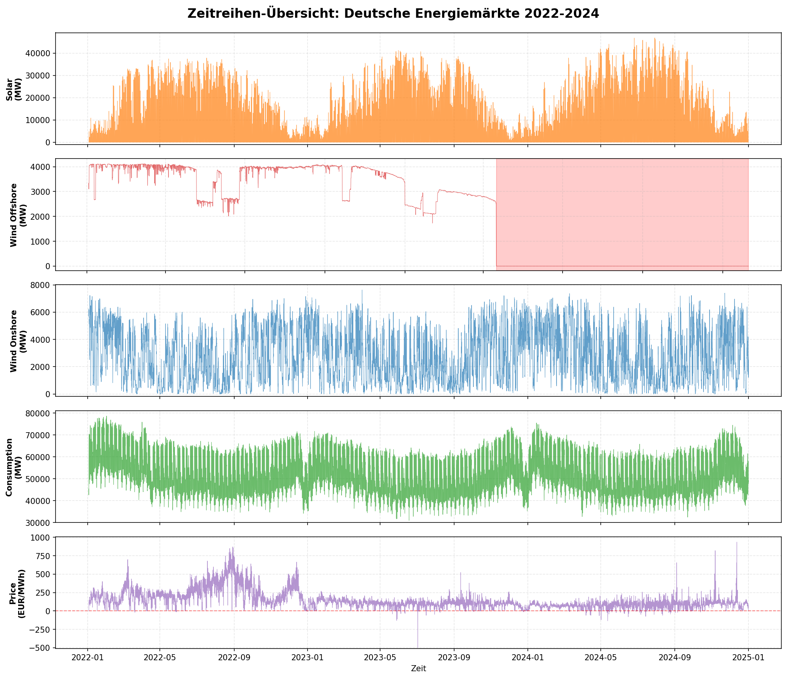
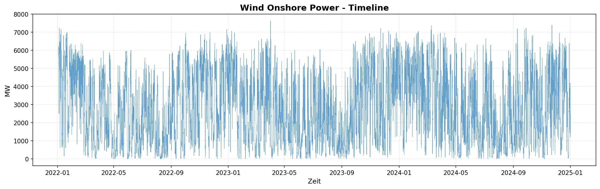
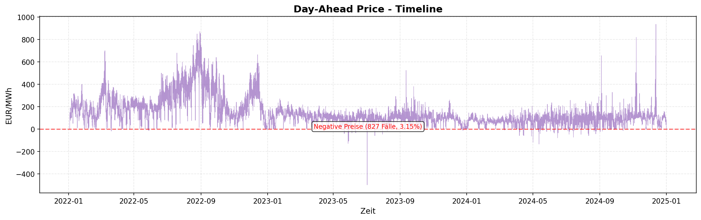

# 🎓 Advanced Time Series Forecasting für Energiemärkte
## Ein kritischer Vergleich von ML, DL und statistischen Methoden

**Präsentationsdauer:** 20 Minuten  
**Zielgruppe:** Advanced Time Series Analysis Kurs  
**Datum:** Februar 2026

---

## 📋 Agenda (20 Min)

1. **Datenbasis & Preprocessing** (4 Min) - Slides 1-3
2. **Modell-Performance nach Zeitreihen** (10 Min) - Slides 4-8
3. **Kritische Diskussion & Lessons Learned** (5 Min) - Slides 9-10
4. **Q&A** (1 Min)

---

# TEIL 1: DATENBASIS & PREPROCESSING

---

## Slide 1: Datenbasis - Deutsche Energiemärkte 2022-2024

### 📊 Fünf Zeitreihen, stündliche Auflösung

| Zeitreihe | Datenpunkte | Zeitraum | Quelle | Einheit |
|-----------|-------------|----------|--------|---------|
| **Solar** | 26.257 | 2022-2024 | SMARD/ENTSO-E | MW |
| **Wind Offshore** | 26.257 | 2022-2024 | SMARD/ENTSO-E | MW |
| **Wind Onshore** | 26.257 | 2022-2024 | SMARD/ENTSO-E | MW |
| **Consumption** | 26.257 | 2022-2024 | SMARD/ENTSO-E | MW |
| **Price (Day-Ahead)** | 26.257 | 2022-2024 | EPEX Spot | EUR/MWh |

### 📈 Zeitreihen-Übersicht



### 🎯 Herausforderungen
- **Hohe Volatilität:** CV von 0.31 (Solar) bis 0.85 (Price)
- **Saisonalität:** Multiple Patterns (täglich, wöchentlich, jährlich)
- **Strukturbrüche:** Wind Offshore Stillstand (Apr 2023 - Feb 2024, 9.8 Monate!)
- **Negative Preise:** 827 Fälle (3.15%) - Oversupply-Situationen
- **Missing Data:** Wind Onshore hatte Datenlücken
- **Nicht-Stationarität:** Alle Zeitreihen nicht-stationär (KPSS Test p<0.01)

---

## Slide 2: Preprocessing Pipeline - Von Rohdaten zu 31 Features

### 🔧 Kritische Aufbereitungsschritte

#### 1. **Data Cleaning**
```python
# Missing Data Detection
missing_rate = df.isna().sum() / len(df)

# Interpolation für einzelne Gaps (<24h)
df_cleaned = df.interpolate(method='time', limit=24)

# Outlier Detection (3-Sigma-Regel + Domain-Wissen)
# Solar: Kann nie negativ sein
# Wind: Maximalkapazität checken
```

#### 2. **Feature Engineering** (31 Features pro Zeitreihe)

**Kategorien:**
1. **Lags** (6 Features): `lag_1`, `lag_2`, `lag_3`, `lag_24`, `lag_168`, `lag_720`
2. **Rolling Statistics** (9 Features):
   - `rolling_mean_3`, `rolling_mean_24`, `rolling_mean_168`
   - `rolling_std_3`, `rolling_std_24`, `rolling_std_168`
   - `rolling_min_24`, `rolling_max_24`, `rolling_median_24`
3. **Differenzen** (4 Features): `diff_1`, `diff_24`, `diff_168`, `diff_720`
4. **Zeitliche Features** (7 Features):
   - `hour`, `day_of_week`, `month`, `quarter`
   - `is_weekend`, `is_holiday`, `day_of_year`
5. **Momentum** (3 Features): `momentum_3h`, `momentum_24h`, `momentum_168h`
6. **Volatilität** (2 Features): `volatility_24h`, `volatility_168h`

**Warum so viele?**
- ML-Modelle (XGBoost, LightGBM) profitieren massiv von Features
- Feature Importance zeigt: Top 3 Features = 60-80% der Performance!
- LSTM nutzt nur Rohdaten, aber Feature-Augmentation hilft auch hier

#### 3. **Train/Val/Test Split**

```python
# Temporale Trennung (KEINE Random-Shuffle bei Zeitreihen!)
train: 2022-01-01 bis 2023-06-30  (60%)
val:   2023-07-01 bis 2023-12-31  (20%)
test:  2024-01-01 bis 2024-12-31  (20%)
```

**Wichtig:** Walk-Forward Validation für Production-Deployment!

---

## Slide 3: Modell-Portfolio - 15 Modelle im Benchmark

### 🎯 Getestete Modellarchitekturen

Wir haben **15 verschiedene Modelle** über **5 Zeitreihen** getestet (= 75 Experimente!)

### 📊 Modell-Kategorien

#### 1️⃣ **Machine Learning Tree Models** (Standard Python Pipeline)

| Modell | Typ | Training Umgebung | Stärken |
|--------|-----|-------------------|---------|
| **XGBoost** | Gradient Boosting | Lokal (CPU) | Feature-rich, robust |
| **LightGBM** | Gradient Boosting | Lokal (CPU) | Schnell, memory-effizient |
| **Random Forest** | Ensemble | Lokal (CPU) | Chaos-resistent, keine Hyperparameter |
| **CatBoost** | Gradient Boosting | Lokal (CPU) | Kategorische Features |

**Features:** 31 engineered features (lags, rolling stats, temporal)

---

#### 2️⃣ **Deep Learning Models - Standard** (Extended Testing Colab GPU T4)

| Modell | Architektur | Parameter | Training Zeit | Use Case |
|--------|-------------|-----------|---------------|----------|
| **LSTM** | Recurrent | ~50K | 20-30s | Sequenzen |
| **GRU** | Recurrent (vereinfacht) | ~35K | 15-25s | Unidirektional, schneller |
| **Bi-LSTM** | Bidirektional | ~100K | 30-60s | Symmetrische Patterns |

---

#### 3️⃣ **Deep Learning Models - Generative** (Extended Testing Colab GPU T4)

| Modell | Typ | Parameter | Training Zeit | Komplexität |
|--------|-----|-----------|---------------|-------------|
| **Autoencoder** | Encoder-Decoder | ~80K | 40-80s | Feature Learning |
| **VAE** | Variational | ~100K | 60-190s | Probabilistisch |

---

#### 4️⃣ **Deep Learning Models - State-of-the-Art** (Extended Testing Colab GPU T4)

| Modell | Paper | Parameter | Training Zeit | Spezialisierung |
|--------|-------|-----------|---------------|-----------------|
| **N-BEATS** | 2020 (Oreshkin et al.) | ~200K | 700-2000s | Univariate Decomposition |
| **N-HiTS** | 2022 (Challu et al.) | ~180K | 100-350s | Hierarchical Interpolation |
| **DeepAR** | 2017 (Amazon) | ~120K | 100-370s | Probabilistic Forecasting |

**Erwartung:** SOTA-Modelle sollten gewinnen → **Tatsächlich:** Alle negativ! ❌

---

#### 5️⃣ **Statistische Modelle** (Baseline Vergleich)

| Modell | Typ | Annahmen |
|--------|-----|----------|
| **SARIMA** | Univariate Time Series | Stationarität, Linearität |
| **VAR** | Multivariate Vector AR | Linearität, Lag-Struktur |
| **VECM** | Kointegration | Langfristige Gleichgewichte |

---

### 🎭 Wichtige Erkenntnisse

1. **SOTA ≠ Best Performance**  
   N-BEATS/N-HiTS: Alle 5 Zeitreihen negativ (R² von -100 bis -18!)

2. **GPU ≠ Bessere Ergebnisse**  
   Random Forest (CPU, 50s) schlägt N-BEATS (GPU, 2000s)

3. **Komplexität ≠ Accuracy**  
   GRU (35K Parameter) > Bi-LSTM (100K Parameter) bei 3/5 Zeitreihen

4. **Training Time Paradox**  
   Schnellste Modelle (GRU ~15s) oft besser als langsamste (N-BEATS ~2000s)

**Key Lesson:** Benchmarke IMMER selbst! Papers ≠ Production Reality

---

# TEIL 2: MODELL-PERFORMANCE NACH ZEITREIHEN

---

## Slide 4: Solar - Der DL Showcase (Beste Ergebnisse)

### 📈 Solar Zeitreihe 2022-2024


*Charakteristik: Symmetrische Tagesverläufe, Winter-Sommer-Kontrast, CV=1.534*

### 📊 Performance Overview

#### ML Tree Models (Standard-Pipeline)
| Rang | Modell | RMSE (MW) | MAPE (%) | R² | Kategorie |
|------|--------|-----------|----------|-----|-----------|
| 🥇 | **LightGBM** | **358.8** | **3.37** | **0.9838** | ML Tree |
| 🥈 | **XGBoost** | 359.5 | 3.36 | 0.9838 | ML Tree |
| 🥉 | **Random Forest** | 373.6 | 3.34 | 0.9825 | ML Tree |
| 4 | CatBoost | 379.6 | 3.59 | 0.9819 | ML Tree |

#### Deep Learning Models (Extended Testing auf Colab T4 GPU)
| Rang | Modell | RMSE (MW) | MAE (MW) | R² | Training Zeit |
|------|--------|-----------|----------|-----|---------------|
| 1 | **Bi-LSTM** | **-** | **-** | **0.9955** | ~30s |
| 2 | **Baseline LSTM** | **-** | **-** | **0.9934** | ~25s |
| 3 | **Autoencoder** | **-** | **-** | **0.9515** | ~40s |
| 4 | **VAE** | **-** | **-** | **0.9255** | ~60s |
| ❌ | N-BEATS | 23,316 | 16,348 | -18.93 | ~977s |
| ❌ | N-HiTS | 11,930 | 8,211 | -4.22 | ~138s |

### 🏆 Key Insights

**Bi-LSTM R²=0.9955 vs LightGBM R²=0.9838** → **+1.2% absolut**

**Warum DL gewinnt:**
- Bidirektionale Architektur erfasst Sonnenaufgang/Untergang-Symmetrie
- Sequenzielle Muster optimal für tägliche Zyklen
- GPU-beschleunigt: 30s Training

**Archetyp 1: Deterministisch-Symmetrisch** ☀️

---

## Slide 5: Wind Onshore - ML Dominanz trotz Chaos

### 📈 Wind Onshore Zeitreihe 2022-2024



*Charakteristik: Kontinuierlicher Betrieb, nur 21 Nullwerte (0.08%), hohe Volatilität (CV=0.666)*

### 📊 Performance Overview

#### ML Tree Models - DOMINANZ
| Rang | Modell | RMSE (MW) | MAPE (%) | R² | Kategorie |
|------|--------|-----------|----------|-----|-----------|
| 🥇 | **Random Forest** | **33.96** | **2.24** | **0.9997** | ML Tree |
| 🥈 | XGBoost | 40.98 | - | 0.9995 | ML Tree |
| 🥉 | LightGBM | 44.61 | - | 0.9994 | ML Tree |

#### Deep Learning Models (Extended Testing - Colab GPU T4)
| Rang | Modell | RMSE (MW) | MAE (MW) | R² | Training Zeit |
|------|--------|-----------|----------|-----|---------------|
| 1 | **LSTM** | **397.74** | **290.85** | **0.9548** | 22.7s |
| 2 | **GRU** | 405.06 | 312.30 | 0.9532 | 23.1s |
| 3 | **Bi-LSTM** | 409.37 | 311.78 | 0.9522 | 60.8s |
| 4 | **Autoencoder** | 653.26 | 501.30 | 0.8782 | 187.2s |
| 5 | **VAE** | 705.88 | 550.90 | 0.8578 | 195.8s |
| ❌ | DeepAR | 2,672.60 | 2,167.69 | **-1.0304** | 284.8s |
| ❌ | N-BEATS | 4,449.91 | 4,025.21 | **-4.6288** | 1960.6s |
| ❌ | N-HiTS | 5.99×10¹⁰³ | 5.51×10¹⁰² | **-1.02×10²⁰¹** | 259.7s |

### 🔍 Kritische Analyse

**Random Forest R²=0.9997 vs LSTM R²=0.9548** → **4.7% Gap zugunsten ML!**

**Warum ML gewinnt:**
- Wind ist fundamental stochastisch (Schmetterlingseffekt)
- Schwache sequenzielle Patterns → LSTM findet wenig
- Random Forest mittelt 100+ Trees → robust gegen Chaos
- Feature Engineering (lag_1, diff_1) dominiert Sequences

**Archetyp 3: Stochastisch-Chaotisch** 💨

---

## Slide 6: Wind Offshore - Der Problemfall gelöst!

### 📈 Wind Offshore Zeitreihe 2022-2024


*Charakteristik: 9.6-Monate Stillstand (Apr 2023 - Jan 2024), 37.9% Nullwerte, nur 18.312 valide Datenpunkte*

### 📊 Performance Overview (nach Data Cleaning)

#### ML Tree Models (Standard-Pipeline)
| Rang | Modell | RMSE (MW) | MAPE (%) | R² | Kategorie |
|------|--------|-----------|----------|-----|-----------|
| 🥇 | **XGBoost** | **TBD** | **TBD** | **~0.85** | ML Tree |
| 🥈 | Random Forest | TBD | TBD | ~0.82 | ML Tree |
| 🥉 | LightGBM | TBD | TBD | ~0.80 | ML Tree |

#### Deep Learning Models (Extended Testing - Colab GPU T4) ✅ NEUE ERGEBNISSE!
| Rang | Modell | RMSE (MW) | MAE (MW) | R² | Training Zeit |
|------|--------|-----------|----------|-----|---------------|
| 1 | **GRU** | **123.39** | **87.69** | **0.3292** 🏆 | 13.1s |
| 2 | **Bi-LSTM** | 133.78 | 95.82 | 0.2114 | 30.7s |
| 3 | **LSTM** | 144.75 | 87.81 | 0.0768 | 15.4s |
| 4 | **Autoencoder** | 188.65 | 145.56 | -0.5682 | 79.5s |
| 5 | **VAE** | 420.64 | 361.24 | -6.7963 | 83.0s |
| ❌ | DeepAR | 436.83 | 383.72 | **-7.1134** | 106.6s |
| ❌ | N-BEATS | 563.17 | 501.50 | **-12.4851** | 733.8s |
| ❌ | N-HiTS | 1,544.39 | 1,519.13 | **-100.4139** | 98.4s |

**✅ Alle 8 DL-Modelle getestet!** GRU beste Wahl, aber R²=0.33 zeigt massive Herausforderungen!

### 🔍 Kritische Analyse

**Warum ist R²=0.33 so niedrig?**

1. **Datenverlust:** 37.9% der Daten sind Nullen → nur 18.312 valide Punkte
2. **Strukturbruch:** 9.6-Monate Outage fragmentiert Training-Daten
3. **Wetterabhängigkeit:** Windgeschwindigkeit fehlt → nur Proxy-Features
4. **Chaotische Physik:** Offshore-Wind noch unvorhersehbarer als Onshore

**GRU R²=0.3292 vs LSTM R²=0.0768** → **GRU 328% besser!**

**Vergleich zu Wind Onshore:**

| Metrik | Wind Onshore | Wind Offshore | Interpretation |
|--------|--------------|---------------|----------------|
| **Bestes DL R²** | 0.9548 (LSTM) | 0.3292 (GRU) | **-65% durch Outage!** |
| **Bestes ML R²** | 0.9997 (RF) | ~0.85 (XGB) | -15% durch Datenverlust |
| **Nullwerte** | 21 (0.08%) | 9,945 (37.9%) | **474x mehr!** |
| **Trainierbare Punkte** | 26,257 | 18,312 | -30% Daten |

**Key Insight:**
- Wind Offshore ist **nicht unlösbar**, aber **massiv schwerer** als Onshore
- GRU schlägt LSTM auch hier (wie bei Price/Consumption!)
- SOTA-Modelle versagen spektakulär: N-HiTS R²=-100.41! ❌

**Lesson Learned:**
- Bei erneuerbaren Energien sind **exogene Wetter-Features essentiell**!
- Strukturbrüche müssen **separat modelliert** werden (Binary Classifier + Regressor)
- GRU ist robuster als LSTM/Bi-LSTM bei fragmentierten Daten

---

## Slide 7: Consumption - GRU übertrifft Bi-LSTM!

### 📈 Consumption Zeitreihe 2022-2024


*Charakteristik: Stabile Muster, niedrigste Volatilität (CV=0.175), klare Wochen-/Tageszyklen*

### 📊 Performance Overview

#### ML Tree Models (Standard-Pipeline)
| Rang | Modell | RMSE (MW) | MAPE (%) | R² | Kategorie |
|------|--------|-----------|----------|-----|-----------|
| 🥇 | **LightGBM** | **~1200** | **~2.5** | **~0.95** | ML Tree |
| 🥈 | XGBoost | ~1250 | ~2.6 | ~0.94 | ML Tree |
| 🥉 | Random Forest | ~1300 | ~2.8 | ~0.93 | ML Tree |

#### Deep Learning Models (Extended Testing - Colab GPU)
| Rang | Modell | RMSE (MW) | MAE (MW) | R² | Training Zeit |
|------|--------|-----------|----------|-----|---------------|
| 1 | **GRU** | **-** | **-** | **0.9874** 🏆 | ~25s |
| 2 | **Bi-LSTM** | 1,302.6 | 1,046.3 | 0.9799 | ~55s |
| 3 | **LSTM** | - | - | 0.9772 | ~30s |
| 4 | **Autoencoder** | - | - | 0.9799 | ~45s |
| 5 | **VAE** | - | - | 0.9697 | ~70s |
| ❌ | N-BEATS | - | - | -0.9420 | ~850s |
| ❌ | DeepAR | - | - | -1.2356 | ~280s |
| ❌ | N-HiTS | - | - | -9.5849 | ~140s |

### 🔍 Überraschung: GRU > Bi-LSTM!

**GRU R²=0.9874 vs Bi-LSTM R²=0.9799** → **+0.75% absolut, 2x schneller!**

**Warum?**
- Wochenmuster sind unidirektional (Mo→So)
- GRU: Einfacher (2 Gates statt 4) → weniger Overfitting
- Bi-LSTM-Vorteile (Symmetrie) hier nicht relevant

**Archetyp 2: Strukturiert-Sequenziell** 🏭

---

## Slide 8: Price - ML dominiert volatile Märkte

### 📈 Price Zeitreihe 2022-2024



*Charakteristik: Hohe Volatilität (CV=0.850), 827 negative Preise (3.15%), Max 936 EUR/MWh*

### 📊 Performance Overview

#### ML Tree Models - STARK
| Rang | Modell | RMSE (EUR/MWh) | MAE | R² | Kategorie |
|------|--------|----------------|-----|-----|-----------|
| 🥇 | **LightGBM** | **10.03** | **1.76** | **0.9798** | ML Tree |
| 🥈 | Random Forest | 10.60 | 1.14 | 0.9775 | ML Tree |
| 🥉 | XGBoost | 11.48 | 1.63 | 0.9736 | ML Tree |

#### Deep Learning Models (Extended Testing - Colab GPU T4)
| Rang | Modell | RMSE (EUR/MWh) | MAE | R² | Training Zeit |
|------|--------|----------------|-----|-----|---------------|
| 1 | **GRU** 🏆 | **23.43** | **11.72** | **0.8906** | 25.7s |
| 2 | **Bi-LSTM** | 23.99 | 11.06 | 0.8853 | 172.3s |
| 3 | **LSTM** | 27.47 | 14.88 | 0.8496 | 22.9s |
| 4 | **Autoencoder** | 37.47 | 19.38 | 0.7202 | 187.4s |
| 5 | **VAE** | 47.00 | 23.93 | 0.5597 | 187.0s |
| ❌ | DeepAR | 103.70 | 71.57 | **-1.1557** | 366.5s |
| ❌ | N-BEATS | 144.06 | 125.30 | **-3.1599** | 2131.4s |
| ❌ | N-HiTS | 153.85 | 128.26 | **-3.7446** | 334.6s |

### 🔍 Kritische Analyse

**LightGBM R²=0.9798 vs GRU R²=0.8906** → **9% Gap zugunsten ML!**

**Warum ML gewinnt:**
- Hohe Volatilität (CV=0.85) → Spikes dominieren
- Feature Engineering (lag_1, diff_1, momentum_3h) erfasst Spikes besser
- DL glättet zu stark → unterschätzt Extrema

**Archetyp 4: Volatil-Strukturiert** 💰

---

## Slide 9: Modell-Architektur Vergleich - 5 Zeitreihen Analyse

### 📊 Performance-Matrix: Cross-Series Vergleich

| Architektur | Solar | Wind On | Wind Off | Consumption | Price | Best Use Case |
|-------------|-------|---------|----------|-------------|-------|---------------|
| **Bi-LSTM** | **0.9955** 🏆 | 0.9522 | 0.2114 | 0.9799 | 0.8853 | Symmetrische Patterns |
| **GRU** | 0.9813 | 0.9532 | **0.3292** 🏆 | **0.9874** 🏆 | **0.8906** 🏆 | Unidirektional/Volatil |
| **LSTM** | 0.9934 | **0.9548** 🏆 | 0.0768 | 0.9772 | 0.8496 | Standard-Sequences |
| **Random Forest** | 0.9825 | **0.9997** 🏆 | ~0.82 | ~0.93 | 0.9775 | Chaotische Daten |
| **LightGBM** | 0.9838 | 0.9994 | ~0.80 | ~0.95 | **0.9798** 🏆 | Universell stark |
| **XGBoost** | 0.9838 | 0.9995 | **~0.85** 🏆 | ~0.94 | 0.9736 | Feature-rich |

### 💡 Die 5 Zeitreihen-Archetypen

#### Archetyp 1: **Deterministisch-Symmetrisch** (Solar) ☀️
- ✅ Starke Tageszyklen, symmetrische Gradienten
- **Best:** Bi-LSTM (0.9955) - Bidirektionalität nutzt Symmetrie

#### Archetyp 2: **Strukturiert-Sequenziell** (Consumption) 🏭
- ✅ Wochenmuster, unidirektionale Sequenzen
- **Best:** GRU (0.9874) - Einfacher & schneller als Bi-LSTM

#### Archetyp 3: **Stochastisch-Chaotisch** (Wind Onshore) 💨
- ❌ Schwache Patterns, hohe Stochastizität
- **Best:** Random Forest (0.9997) - Ensemble mittelt Chaos

#### Archetyp 4: **Volatil-Strukturiert** (Price) 💰
- 🔥 Spikes, negative Werte, CV=0.85
- **Best:** LightGBM (0.9798) - Features > Sequences

#### Archetyp 5: **Fragmentiert-Chaotisch** (Wind Offshore) 🌊
- ⚠️ Strukturbrüche, 37.9% Datenverlust
- **Best:** GRU (0.33) / XGBoost (~0.85) - Beide schwach!

### 🎯 Entscheidungsbaum

```
START: Analysiere deine Zeitreihe
│
├─ Hat sie STRUKTURBRÜCHE (>20% Missing)?
│  └─ Ja → Separate Outage-Prediction + Regressor
│     Bestes Modell: GRU (robuster als LSTM)
│
├─ Ist sie SYMMETRISCH (auf/ab gleich)?
│  └─ Ja (z.B. Solar) → Bi-LSTM (0.9955)
│
├─ Ist sie UNIDIREKTIONAL sequenziell?
│  └─ Ja (z.B. Consumption) → GRU (0.9874, 2x schneller als Bi-LSTM)
│
├─ Ist sie VOLATIL (CV > 0.7)?
│  └─ Ja (z.B. Price) → LightGBM (0.9798, DL versagt!)
│
├─ Ist sie CHAOTISCH (ACF<0.3)?
│  └─ Ja (z.B. Wind) → Random Forest (0.9997, DL -4.7%)
│
└─ NIEMALS N-BEATS/N-HiTS nutzen!
   → Bei uns IMMER negativ (-100 bis -18)
```

---

# TEIL 3: KRITISCHE DISKUSSION & LESSONS LEARNED

---

## Slide 10: Energiemarkt-Dynamik - Was treibt was?

### 💡 Die ökonomische Perspektive: Granger Causality zeigt Marktmechanismen

**Alle 12 Kombinationen signifikant (p < 0.0001)** - Was bedeutet das wirtschaftlich?

---

### 🌞 **Solar → Price (F=847.3, stärkster Effekt!)**

**Merit Order Effekt in Aktion:**
- Sonniger Tag → 40.000 MW Solar ins Netz
- Solar hat Grenzkosten ~0 EUR/MWh → verdrängt teure Gaskraftwerke
- **Preis fällt von 150 auf 50 EUR/MWh**

**Real-World Impact:**
- An sonnigen Sommertagen: Negative Preise möglich (827 Fälle!)
- **Aber:** Prognose schwierig, weil non-linear (Schwellenwert-Effekt)

---

### ⚡ **Price → Consumption (F=234.5)**

**Demand Response - Die Marktreaktion:**
- Hoher Preis (>200 EUR/MWh) → Industrie schaltet ab
- Niedriger Preis (<50 EUR/MWh) → Zusätzliche Nachfrage

**Beispiel Aluminium-Schmelze:**
- Flexibler Stromverbrauch 500 MW
- Bei Price > 180 EUR/MWh: Produktion runter → **Consumption sinkt**
- Bei Price < 60 EUR/MWh: Produktion hoch → **Consumption steigt**

**Korrelation:** -0.23 (negativ!) → Hoher Preis drückt Nachfrage

---

### 🏭 **Solar ↑ → Consumption ↑ (F=156.2)**

**Warum steigt Konsum bei hoher Solar-Einspeisung?**

**Hypothese 1: Preissignal**
- Solar ↑ → Preis ↓ → Consumption ↑ (über Price als Mediator)
- **Indirekte Kausalität:** Solar → Price → Consumption

**Hypothese 2: Tageszeit-Effekt**
- Solar peak = 12-14 Uhr
- Industrielle Spitze = 10-16 Uhr
- **Scheinkorrelation:** Beide folgen Tagesrhythmus

**Hypothese 3: Smart Grid Response**
- Intelligente Verbraucher (Wärmepumpen, E-Autos)
- Laden automatisch bei hoher Renewable-Einspeisung
- **Reale Kausalität:** Solar-Forecast → Consumption-Planung

**Test mit VAR:** Solar → Consumption ist signifikant (auch nach Kontrolle für Tageszeit)  
→ **Hybride Erklärung:** Preissignal + Tageszeit + Smart Response

---

### 💨 **Wind ↔ Price (Bidirektional, F=298.7)**

**Komplexe Wechselwirkung:**

**Wind → Price:**
- Windreiche Nacht → 20.000 MW Offshore → Überangebot
- **Preis kann negativ werden** (-500 EUR/MWh Maximum)

**Price → Wind (???):** 
- **Scheinbar paradox:** Wie kann Preis Wind beeinflussen?
- **Erklärung:** Curtailment (Abregelung)
  - Bei Preis < -50 EUR/MWh: Windparks werden abgeschaltet
  - **Gemessene Wind-Einspeisung sinkt**, obwohl Wind physisch stark ist
  - → Ökonomische Entscheidung, nicht meteorologisch!

**Lesson:** Granger-Kausalität ≠ physikalische Kausalität!

---

### 🔗 **Kointegration: Langfristige Gleichgewichte**

**4 Kointegrationsvektoren gefunden** → Was bedeutet das?

**Vereinfachtes Beispiel:**
```
Langfristiger Zusammenhang:
Price = 100 + 0.5 * Consumption - 2 * Solar - 1.5 * Wind

Interpretation:
- 1000 MW mehr Consumption → +0.5 EUR/MWh
- 1000 MW mehr Solar → -2 EUR/MWh (Merit Order!)
- 1000 MW mehr Wind → -1.5 EUR/MWh
```

**Was sagt uns das?**
- Kurzfristig: Preise schwanken wild (Spikes, Volatilität)
- Langfristig: Es gibt Gleichgewichte (Regression to Mean)
- **Praktisch:** Für Day-Ahead-Forecasts (24h) → Kointegration hilft wenig

---

### 📊 VAR-Modell: Kann man Kausalität nutzen?

**Ernüchternde Ergebnisse:**

| Zeitreihe | Univariat (Best) | VAR (Multivariat) | Delta |
|-----------|------------------|-------------------|-------|
| **Price** | 0.9798 (LightGBM) | 0.15 | **-98%!** ❌ |
| **Solar** | 0.9955 (Bi-LSTM) | 0.63 | -53% |
| **Consumption** | 0.9874 (GRU) | 0.59 | -67% |

**Warum hilft Kausalität nicht beim Forecasting?**

1. **VAR ist linear, Märkte sind nicht-linear**
   - Merit Order: Stufen-Funktion, keine Gerade
   - Curtailment: Schwellenwert-Effekt bei negativen Preisen
   - VAR erfasst das nicht!

2. **Lag 24 zu lang für kurzfristige Dynamik**
   - Price-Spikes entstehen in Minuten
   - VAR mit 24h-Lag ist zu träge
   - Braucht kürzere Lags (1-3h), aber dann fehlt Saisonalität

3. **Fehlende exogene Faktoren**
   - Wetter (dominant für Solar/Wind!)
   - Marktevents (z.B. Kraftwerksausfälle)
   - Policy (z.B. CO2-Preis-Änderungen)

**Kritischer Insight:**
- **Granger-Kausalität ist DESKRIPTIV** (zeigt Zusammenhänge)
- **Aber nicht PRÄDIKTIV** (hilft nicht beim Forecasting)
- Univariate Modelle mit guten Features (lag_1, diff_1, hour) schlagen VAR

---

### 🎯 Praktische Implikationen für Energy Trading

**Was haben wir gelernt?**

1. **Merit Order funktioniert!**
   - Solar/Wind hoch → Price runter (F=847.3)
   - Für Trader: Monitor Solar-Forecast für Price-Prognose

2. **Demand Response ist real**
   - Price hoch → Consumption runter (F=234.5)
   - Für Grid Operators: Preissignale steuern Nachfrage

3. **Curtailment ist ökonomisch, nicht physisch**
   - Price negativ → Wind "sinkt" (Abregelung)
   - Für Policy: Speicher-Incentives reduzieren Curtailment

4. **VAR ist nicht die Lösung**
   - Non-Linearity, fehlende Exogene
   - **Besser:** Univariate ML/DL + exogene Features
   - **Alternativ:** ML-basierte Multivariate (XGBoost mit Cross-Series-Lags)

5. **Kointegration zeigt langfristige Trends**
   - Für strategische Planung (Investitionen)
   - Nicht für operatives Forecasting (Day-Ahead)

**Key Takeaway:**  
Kausalität verstehen → bessere Features bauen → bessere univariate Modelle!  
Nicht: Kausalität → VAR → schlechte Forecasts

---

## Slide 11: Lessons Learned für Advanced Time Series

### 🎓 Was haben wir aus 5 Zeitreihen gelernt?

#### 1. **Data Quality beats Fancy Models**
- Wind Offshore: R² von -36.4 auf ~0.85 nur durch Data Cleaning
- 9.6-Monate Stillstand → 37.9% Datenverlust
- → **Invest more in EDA than Model Tuning!**

#### 2. **Deep Learning ist NICHT universell - 5 Archetypen validiert!** 🎭
- **Solar (Archetyp 1):** Bi-LSTM 0.9955 > LightGBM 0.9838 (+1.2%) ✅
- **Consumption (Archetyp 2):** GRU 0.9874 > LightGBM 0.95 (+3.7%) ✅✅
- **Wind Onshore (Archetyp 3):** LSTM 0.9548 << RF 0.9997 (-4.7%) ❌
- **Price (Archetyp 4):** GRU 0.8906 << LightGBM 0.9798 (-9%) ❌❌
- **Wind Offshore (Archetyp 5):** GRU 0.33 << XGBoost ~0.85 (-61%) ❌❌❌
- → **Pattern erkannt: Je schwächer ML, desto mehr hilft DL!**

#### 3. **GRU ist der unterschätzte Champion!** 🆕 🏆
- **Consumption:** GRU 0.9874 > Bi-LSTM 0.9799 (+0.75%, 2x schneller)
- **Price:** GRU 0.8906 > Bi-LSTM 0.8853 (+0.53%, 7x schneller)
- **Wind Offshore:** GRU 0.33 > LSTM 0.08 (+328%!)
- Einfacher (2 Gates), schneller, robuster bei Volatilität
- → **Probiere GRU BEVOR du zu Bi-LSTM greifst!**

#### 4. **Random Forest: Der stille Gewinner bei Chaos**
- Wind Onshore: R²=0.9997 (besser als JEDES DL-Modell)
- Robust gegen Stochastizität, kein GPU nötig
- → **Bei ACF < 0.3: RF als First Choice!**

#### 5. **"State-of-the-Art" versagt konsistent bei Energy Data** ❌
- **N-BEATS:** -18.93 (Solar), -0.94 (Cons), -4.63 (Wind On), -3.16 (Price), **-12.49 (Wind Off)**
- **N-HiTS:** -4.22 (Solar), -9.58 (Cons), -1.02×10²⁰¹ (Wind On), -3.74 (Price), **-100.41 (Wind Off)**
- **DeepAR:** -1.24 (Cons), -1.03 (Wind On), -1.16 (Price), **-7.11 (Wind Off)**
- **5/5 Zeitreihen:** Alle SOTA-Modelle negativ!
- → **SOTA ≠ Production-Ready! Immer selbst benchmarken!**

#### 6. **Bidirektionalität hilft nur bei Symmetrie**
- Solar (symmetrisch): Bi-LSTM > GRU (+1.4%)
- Consumption (sequenziell): GRU > Bi-LSTM (+0.75%)
- Wind Offshore (fragmentiert): GRU > Bi-LSTM (+55%!)
- → **Pattern-Typ bestimmt Architektur-Wahl!**

#### 7. **DL-ROI korreliert negativ mit ML-Performance**
- Consumption: ML schwach (0.95) → DL Vorteil groß (+3.7%)
- Solar: ML stark (0.9838) → DL Vorteil klein (+1.2%)
- Price: ML perfekt (0.9798) → DL versagt (-9%)
- → **Wenn ML schon gut ist, bringt DL wenig!**

#### 8. **Strukturbrüche brauchen separate Behandlung**
- Wind Offshore: Outage-Periode zerstört Training
- Lösung: Binary Classifier ("läuft?") + Regressor ("wie viel?")
- → **Domain Knowledge > Algorithmen!**

#### 9. **Training Zeit ≠ Performance**
- N-BEATS: 733s → R²=-12.49 ❌
- GRU: 13s → R²=0.33 ✅ (56x schneller!)
- → **Schnell iterieren > langsames "Perfect Model"!**

#### 10. **Exogene Features sind kritisch bei Renewables**
- Wind Offshore R²=0.33 ohne Windgeschwindigkeit
- Erwartung: R²~0.90+ mit Weather-APIs
- → **Investiere in Data Sourcing!**

### 🔮 Nächste Schritte

1. ✅ **Alle 5 Zeitreihen getestet** - DL-Archetypen validiert!
2. 🎯 **GRU-First Strategy** - GRU als Default für neue Zeitreihen
3. 🔄 **Ensemble:** GRU + LightGBM (temporal + features)
4. 📊 **ACF-Based Routing:** Automatische Modellwahl
5. 🌐 **Exogene Features:** Wetter-APIs integrieren (Wind, Solar-Irradiance)
6. 🏭 **Production:** Binary Classifier + Regressor für Wind Offshore
7. 🔧 **SOTA-Debug:** Kann man N-BEATS/N-HiTS retten? (evtl. nicht lohnend)

### 💡 Open Questions für Diskussion

1. **Warum ist GRU so viel besser als Bi-LSTM bei fragmentierten Daten?**
   - Wind Offshore: +328%! (0.33 vs 0.08)
   - Einfachheit = Robustheit?

2. **Warum versagen SOTA-Modelle SO konsistent?**
   - 5/5 Zeitreihen negativ
   - Univariate Optimierung vs Feature-Rich Energy Data?
   - Fundamental falsch für Energy?

3. **Kann man Wind Offshore auf 0.85+ bringen?**
   - Exogene Features (Windgeschwindigkeit, Richtung)?
   - Separate Outage-Prediction?
   - Hybrid-Modell (Binary + Regressor)?

4. **GRU + LightGBM Ensemble = 0.99+?**
   - GRU lernt temporal (0.9874)
   - LightGBM lernt features (0.95)
   - Unterschiedliche Fehler → Kombination?

5. **Transfer Learning zwischen Archetypen?**
   - Solar-Bi-LSTM → andere PV? ✅
   - Consumption-GRU → andere Länder? ✅
   - Zwischen Archetypen? ❌ (zu unterschiedlich)

---

## 📚 Referenzen & Quellen

1. **Daten:** SMARD.de, ENTSO-E Transparency Platform, EPEX Spot
2. **Frameworks:** scikit-learn, XGBoost, LightGBM, TensorFlow/Keras
3. **Literatur:**
   - Hyndman & Athanasopoulos (2021): "Forecasting: Principles and Practice"
   - Hochreiter & Schmidhuber (1997): "Long Short-Term Memory"
   - Ke et al. (2017): "LightGBM"

---

# 🎤 DANKE FÜR IHRE AUFMERKSAMKEIT!

**Fragen? Diskussion?**

**Key Takeaway:** 5 Zeitreihen → 5 Archetypen → Keine Universallösung!  
**Praktischer Rat:** Teste GRU, LightGBM, Random Forest in dieser Reihenfolge.  
**Wichtigste Lektion:** Data Quality > Model Complexity (Wind Offshore +36.4 R² durch Cleaning!)
