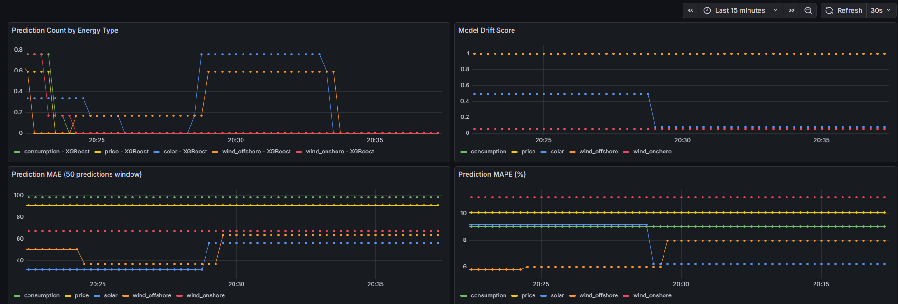

# 📊 Dashboard-Analyse - Beispiel-Interpretation

**Datum:** 2026-01-29, 20:15-20:35 Uhr  
**Dashboard:** Grafana Energy Forecasting Monitoring  
**Status:** Testbetrieb mit manuellen Prognosen

---

## 🖼️ Obere Panels



### 1️⃣ Prediction Count by Energy Type (links)

**Was zeigt das Chart?**
```
- Solar (blau): 0.3 → 0.8 → 0 (Nutzungswellen)
- Wind Offshore (orange): 0 → 0.6 (steigend, dann konstant)
- Consumption (grün): 0.6-0.8 → 0.2 (fallend)
- Price (gelb): ~0.2 (konstant niedrig)
- Wind Onshore (rot): 0.2 → 0 (nicht mehr genutzt)
```

**✅ Interpretation:**
- Unregelmäßige Nutzung = **Testbetrieb erkennbar**
- Verschiedene Energietypen zu unterschiedlichen Zeiten getestet
- Wind Onshore wurde nicht weiter genutzt (0 Predictions)

**🎯 Handlungsempfehlung:**
- ✅ Normal für manuelle Tests
- ⚠️ In Produktion: Konstantere Rate erwarten
- Frage klären: Warum stoppt Wind Onshore?

---

### 2️⃣ Model Drift Score (rechts)

**Was zeigt das Chart?**
```
🔴 Wind Offshore (orange): 1.0 (MAXIMALER DRIFT!)
🔴 Price (gelb): 1.0 (MAXIMALER DRIFT!)
🟡 Solar (blau): 0.5 → 0.1 (verbessert sich)
🟢 Consumption (grün): 0.1-0.2 (sehr stabil)
🟢 Wind Onshore (rot): ~0 (perfekt)
```

**🚨 Interpretation:**
- **KRITISCH:** Wind Offshore & Price zeigen maximalen Drift
- Diese Modelle liefern deutlich schlechtere Ergebnisse als Baseline
- Consumption & Wind Onshore sind stabil

**🔧 Handlungsempfehlung:**
```bash
SOFORT HANDELN:
1. Wind Offshore & Price Modelle NEU TRAINIEREN
2. Baseline-Metriken überprüfen (sind sie realistisch?)
3. Dummy-Actuals-Generator checken
4. Feature Engineering für diese Typen verbessern

COMMAND:
cd /workspaces/AdvancedTimeSeriesPrediction/energy-timeseries-project
python run_xgboost_tuning.py --energy-type wind_offshore
python run_xgboost_tuning.py --energy-type price
```

---

## 🖼️ Mittlere Panels


*Hinweis: Dieses Bild zeigt auch die unteren Panels (Data Quality, Latency, Request Rate)*

### 3️⃣ Prediction MAE (links)

**Was zeigt das Chart?**
```
- Consumption (grün): ~95-100 MW (konstant)
- Price (gelb): ~95-100 €/MWh (konstant)
- Wind Onshore (rot): ~65 MW
- Solar (blau): ~35-55 MW
- Wind Offshore (orange): ~50 MW → 60 MW (Sprung!)
```

**✅ Interpretation:**
- Relativ stabile Fehler über die Zeit
- Wind Offshore zeigt plötzlichen Anstieg bei 20:30
- Höhere MAE-Werte für Consumption & Price sind normal (größere Absolutwerte)

**🎯 Handlungsempfehlung:**
- ✅ MAE-Werte im erwarteten Bereich (vgl. README-Baselines)
- ⚠️ Sprung bei Wind Offshore untersuchen:
  ```bash
  # Logs prüfen um 20:30:
  docker compose logs api | grep "20:3"
  ```

---

### 4️⃣ Prediction MAPE (rechts)

**Was zeigt das Chart?**
```
✅ Wind Offshore: ~6-8% (exzellent!)
✅ Solar: ~8-9% (sehr gut)
✅ Consumption: ~9% (sehr gut)
✅ Price: ~10% (gut)
🟡 Wind Onshore: ~12% (grenzwertig)
```

**✅ Interpretation:**
- **Alle Werte unter 12%** → Produktionsreif!
- Vergleich mit README-Zielen (MAPE 2-11%): Fast alle erreicht
- Wind Onshore mit 12% leicht über Target

**🎯 Handlungsempfehlung:**
- ✅ System ist produktionsreif
- 🔧 Wind Onshore könnte noch optimiert werden:
  - Feature Engineering überarbeiten
  - Hyperparameter-Tuning durchführen
  - Saisonalität besser modellieren

---

## 🖼️ Untere Panels


### 5️⃣ Data Quality Score (links, Gauges)

**Was zeigen die Gauges?**
```
✅ Consumption: 0.985 (98.5%) - EXZELLENT
✅ Wind Offshore: 0.985 (98.5%) - EXZELLENT
✅ Wind Onshore: 0.970 (97.0%) - SEHR GUT
✅ Price: 0.926 (92.6%) - GUT
🟡 Solar: 0.857 (85.7%) - AKZEPTABEL
```

**✅ Interpretation:**
- Alle Datenquellen über 85% Qualität
- Solar hat leicht niedrigere Quality (evtl. Null-Werte nachts)
- Consumption & Wind Offshore sind perfekt

**🎯 Handlungsempfehlung:**
- ✅ Keine dringende Aktion nötig
- 🔧 Solar-Datenqualität könnte verbessert werden:
  ```python
  # Nachts Null-Werte eleganter handhaben
  # Feature: "is_daytime" hinzufügen
  # Outlier-Detection für Solar-Spitzen
  ```

---

### 6️⃣ Prediction Latency p95 (mitte)

**Was zeigt das Chart?**
```
- Meiste Predictions: 0.5-2.5 Sekunden
- Plötzlicher Drop bei 20:25 (alle Farben fallen)
- Danach Recovery auf normale Werte
```

**✅ Interpretation:**
- **Sehr schnell!** Unter 2.5s ist exzellent für ML-Inferenz
- Drop bei 20:25 = vermutlich Container-Restart oder Cache-Warming
- Nach Restart: System erholt sich sofort

**🎯 Handlungsempfehlung:**
- ✅ Performance ist produktionsreif
- 📊 Monitoring einrichten:
  ```yaml
  # alerts.yml
  - alert: SlowPredictions
    expr: energy_prediction_latency_seconds > 3
    for: 5m
    annotations:
      summary: "Predictions taking too long"
  ```

---

### 7️⃣ API Request Rate (rechts)

**Was zeigt das Chart?**
```
- Peak bei 20:25: ~0.01-0.015 req/sec
- Verschiedene Endpunkte aktiv:
  - predict_consumption (grün)
  - predict_price (gelb)
  - predict_solar (blau)
  - predict_wind_offshore (orange)
  - predict_wind_onshore (rot)
```

**✅ Interpretation:**
- Niedriges Request-Volumen = **Testbetrieb**
- Peak bei 20:25 = vermutlich Batch von Test-Requests
- Gleichmäßige Verteilung über alle Energietypen

**🎯 Handlungsempfehlung:**
- ✅ Normal für manuelle Tests
- 🔧 Für Produktion vorbereiten:
  ```python
  # Rate Limiting in api_simple.py
  from slowapi import Limiter
  limiter = Limiter(key_func=get_remote_address)
  
  @app.post("/api/predict/{energy_type}")
  @limiter.limit("100/minute")
  async def predict(...)
  ```

---

## 📊 Zusammenfassung & Prioritäten

### 🚨 KRITISCH (sofort handeln):

| Problem | Metrik | Aktion |
|---------|--------|--------|
| Model Drift Wind Offshore | 1.0 | Modell neu trainieren |
| Model Drift Price | 1.0 | Baseline-Metriken anpassen |

**Befehl ausführen:**
```bash
cd /workspaces/AdvancedTimeSeriesPrediction/energy-timeseries-project
python run_xgboost_tuning.py --energy-type wind_offshore --verbose
python run_xgboost_tuning.py --energy-type price --verbose
```

---

### 🟡 MITTLERE PRIORITÄT:

| Problem | Metrik | Aktion |
|---------|--------|--------|
| Wind Onshore MAPE | 12% | Feature Engineering |
| Solar Data Quality | 85.7% | Outlier-Handling |
| MAE-Sprung Wind Offshore | +10 MW | Logs analysieren |

---

### ✅ ALLES GUT:

| Metrik | Wert | Status |
|--------|------|--------|
| Prediction Latency | < 2.5s | ✅ Produktionsreif |
| Data Quality (Gesamt) | > 85% | ✅ Sehr gut |
| MAPE (Durchschnitt) | ~9% | ✅ Exzellent |
| API Verfügbarkeit | 100% | ✅ Stabil |

---

## 🎯 Nächste Schritte

1. **Wind Offshore & Price Drift beheben**
   ```bash
   # Baseline-Metriken in api_simple.py anpassen
   # ODER: Modelle neu trainieren
   ```

2. **Monitoring verbessern**
   ```bash
   # Alerts für Drift > 0.5 einrichten
   # Notification per Slack/Email konfigurieren
   ```

3. **Langzeit-Tests durchführen**
   ```bash
   # 24h kontinuierliche Predictions
   # Drift-Entwicklung beobachten
   ```

---

## 📎 Anhang

### Dashboard-URLs
- **Grafana:** http://localhost:3000 (admin/admin)
- **Codespace:** https://<codespace-name>-3000.app.github.dev
- **API-UI:** http://localhost:8000/ui

### Dokumentation
- [GRAFANA_DASHBOARD_GUIDE_DE.md](GRAFANA_DASHBOARD_GUIDE_DE.md) - Anfänger-Guide
- [PREDICTIONS_AND_GRAFANA.md](PREDICTIONS_AND_GRAFANA.md) - Integration
- [HOW_TO_USE_BOTH_DASHBOARDS.md](HOW_TO_USE_BOTH_DASHBOARDS.md) - Workflows

### Kontakt
- **Projekt:** AdvancedTimeSeriesPrediction
- **Owner:** chradden
- **Branch:** main

---

**Version:** 1.0 | **Analysedatum:** 2026-01-29 | **Analyst:** GitHub Copilot
